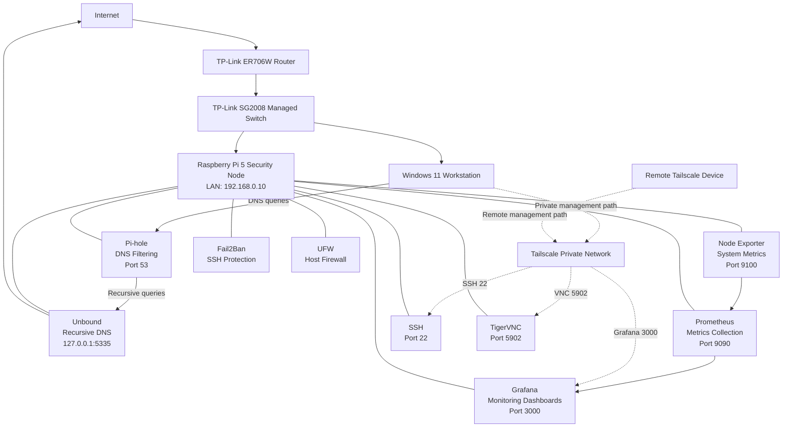

# Network Architecture Diagram

This diagram shows the network paths, service relationships, monitoring flow, and management access controls implemented in the Raspberry Pi security infrastructure lab.

## Access-Control Summary

| Service | LAN Access | Tailscale Access | Exposure |
|---|---|---|---|
| DNS — 53 | Allowed | Allowed | Required for DNS clients |
| Pi-hole Web — 80/443 | Allowed | Allowed | Administrative interface |
| SSH — 22 | Blocked | Allowed | Private management only |
| Grafana — 3000 | Blocked | Allowed | Private monitoring access |
| TigerVNC — 5902 | Blocked | Allowed | Private remote desktop |
| Unbound — 5335 | Localhost only | Not exposed | Internal DNS resolver |
