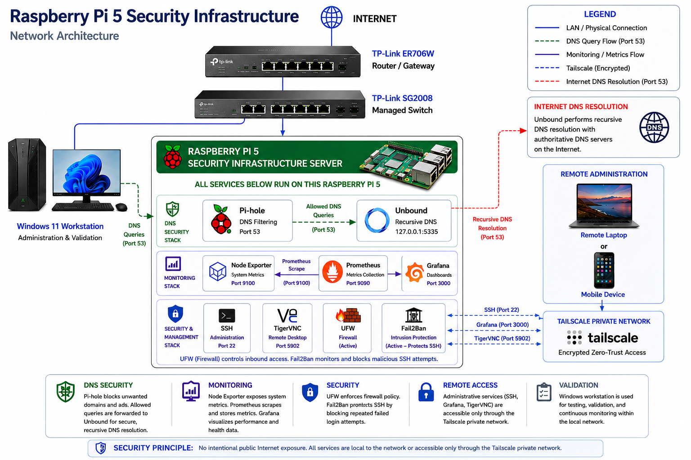

# Network Architecture Diagram

This diagram shows the network paths, service relationships, monitoring flow, and management access controls implemented in the Raspberry Pi security infrastructure lab.

# Network Architecture

The diagram below shows the physical network topology, DNS resolution path,
monitoring stack, security controls, and private remote administration path
used in the Raspberry Pi 5 security infrastructure lab.

## Architecture Summary

The Raspberry Pi 5 operates as a single security infrastructure server hosting
multiple local services.

### DNS Security

Client DNS requests are sent to Pi-hole for filtering. Approved queries are
forwarded to Unbound, which performs recursive DNS resolution.

### Monitoring

Node Exporter collects system metrics from the Raspberry Pi. Prometheus collects
and stores the metrics, while Grafana provides monitoring dashboards and
visualization.

### Security and Remote Administration

UFW enforces host-based firewall policy, while Fail2Ban monitors authentication
activity and responds to repeated failed login attempts.

Administrative access is restricted to the private Tailscale network for SSH,
Grafana, and TigerVNC access.

## Access-Control Summary

| Service | LAN Access | Tailscale Access | Exposure |
|---|---|---|---|
| DNS — 53 | Allowed | Allowed | Required for DNS clients |
| Pi-hole Web — 80/443 | Allowed | Allowed | Administrative interface |
| SSH — 22 | Blocked | Allowed | Private management only |
| Grafana — 3000 | Blocked | Allowed | Private monitoring access |
| TigerVNC — 5902 | Blocked | Allowed | Private remote desktop |
| Unbound — 5335 | Localhost only | Not exposed | Internal DNS resolver |
